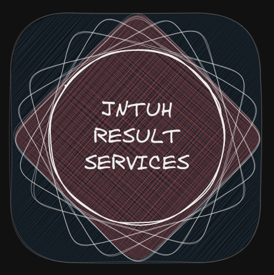

 

Collection of <i>truly</i> Open-source Micro-Services, Backend Applications and,
Front-End Clients to provide JNTU, Hyderabad Engineering Results.
 

We are Open Source enthusiasts aiming to solve issues that students face with
our [University](https://jntuh.ac.in/) Examination [Results
Portal](results.jntuh.ac.in/). We are not driven by any organization, or for
the matter of fact, even our University, to pursue this endeavour, we are just
developers creating and taking time off helping out our fellow friends &
students.

Currently, we have the following repositories that provide Undergraduate
Engineering Results:

- **[JNTUH Results Statistics Web Application](https://github.com/jntuh-results-services/jntuh-results-stats)**
- **[SGPA Calculator Mobile Application](https://github.com/jntuh-results-services/sgpa-calculator)**
- **[Results REST-API](https://github.com/jntuh-results-services/sgpa-rest-api)**

**[API
Documentation](https://hemanthk.me/sgpa-rest-api-docs/)**
is also available for the guidelines to use the REST-API.

**Collaborators**

- [Thilak Reddy](https://github.com/ThilakReddyy)
- [Syed Ansar](https://github.com/Syed-Ansar)

Contributions are always welcome! We look forward to all those passionate
developers out there who are willing to contribute to these projects and help
our fellow students!

<!-- TODO: Add Contribution Guidelines here -->

All our clients and services are licensed under
[GPL-V3](https://www.gnu.org/licenses/gpl-3.0.en.html) ensuring that the work
produced here, and its derivatives remain truly Open Source.

Soon, we also plan to extend our applications and services to provide results
for streams such as B.Pharmacy and also based on the request of students and
teachers along with new features.

**Core Maintainer** [Hemanth Kotagiri](https://github.com/hemanth-kotagiri)
